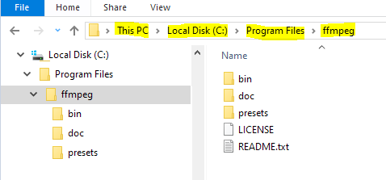
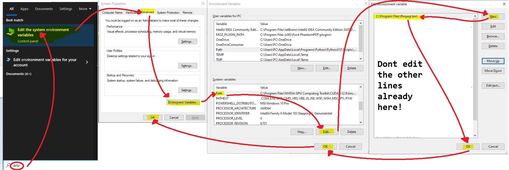
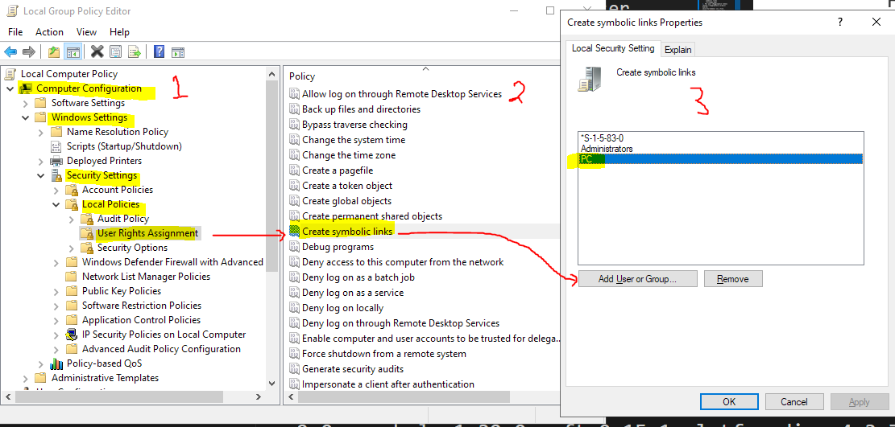
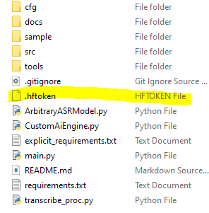

# Jaffe-Lurie Transcribble
### An offline user friendly transcription tool
- Uses various [`openai-whisper`](https://github.com/openai/whisper) based models to transcribe audio or video files.
- Runs locally.
- Outputs into a clean .cha file by utterance.
- As always, TRUST NOTHING GENERATED BY AI, and always verify

## Installation:
1. **Internet** 
    - For installation of the transcriber
    - For the AI model download - on the first time you use a model

1. **Python 3.11+**:
    - Download and install python here: [https://www.python.org/downloads/](https://www.python.org/downloads/)
    - _Tested on 3.11, 3.12, and 3.13_
    - If using the installer, use the following configuration options:
        - Click on `Modify` or `Customize installation` _(whichever one you see)_
        - Select `Add python.exe to PATH` _(for ease of use)_
        - Select `pip` _(to install pip)_
        - Select `tcl/tk and IDLE` _(to install tkinter)_
        - Select `Add python to environment variables` _(might be on the second page)_
        - Select `Download debugging symbols` _(might be on the second page)_
        - Reccomended to select `Install Python for all users` _(might be on the second page)_
    - You might need to restart your computer here if it prompts you for it
    - _NOTE: If you already have python installed, make sure you have tkinter tcl/tk installed!_
        - Check by running the command:
            `python -m tkinter`
            If a window pops up, you have it installed and can continue to the next requirement step!
        - To install:
            - MacOS:
                - Run the command: `brew install python-tk`
            - Windows:
                - Download the installer for the version of python you currently have and follow the installation configuration.
            `python --version`

1. **GIT**:
    - Check to see if you have git installed by running the command:
        `git --version`
        or 
        `python -c 'command="git"; import shutil; path = shutil.which(command); print(f"{command} installed @ {path}" if path else f"{command} is not installed or cannot be found!")'`
        
        If you do have git, you can skip to the next requirement.
    - See here for detailed guide on installing git or skip to the section for your OS: [https://git-scm.com/book/en/v2/Getting-Started-Installing-Git#main](https://git-scm.com/book/en/v2/Getting-Started-Installing-Git#main)
    - MacOS:
        - Install the Xcode Command Line Tools. On Mavericks (10.9) or above, start by checking to see if you have it installed already by running the following command:
        `git --version`
        If you don’t have it installed already, it should prompt you to install it. If it does not, see the detailed guide on installing git above.
    - Windows:
        - Install git for windows from the offical git website: [https://git-scm.com/downloads/win](https://git-scm.com/downloads/win)
            - Click on the first install link. It should look like the following
                > Click here to download the latest (##.##.##) x64 version of Git for Windows.
            - When installing, use the default configuration for all steps except:
                - **Choosing the default editor used by Git**: 
                    Select an application that you already have for ease of use, recomended to select "Use Notepad as Git's default editor".
                - **Configure line ending conversions**: 
                    Choose "checkout as-is, commit Unix Style line endings".
                - **Configure extra options**: 
                    Select "Enable symbolic links" - checking this here might allow you to skip one of the install steps later on.
    - Linux:
        - `sudo apt install git-all`

1. **FFMPEG**:
    - Check to see if you have FFMPEG installed by running the command:
        `ffmpeg -version`
        or
        `python -c 'command="ffmpeg"; import shutil; path = shutil.which(command); print(f"{command} installed @ {path}" if path else f"{command} is not installed or cannot be found!")'`
    - MacOS: install ffmpeg to be made available by the command line
        - `brew install ffmpeg`
    - Windows:
        - Install here [instant download link to zip file](https://github.com/BtbN/FFmpeg-Builds/releases/download/latest/ffmpeg-master-latest-win64-gpl-shared.zip) or follow the instructions on the offical ffmpeg webiste here [https://ffmpeg.org/download.html](https://ffmpeg.org/download.html).
        - If you downloaded a zip file follow these steps:
            - Unzip (or move the unzipped files) to `C:/Program Files/ffmpeg`
                The results should look like the following:
                
            - Add the `C:/Program Files/ffmpeg/bin` (or wherever you downloaded it to + `/bin`) to your system environment PATH variable
                - in windows bar search, type "`env`" and follow the arrows in the image below
                - when you click "new" enter `C:\Program Files\ffmpeg\bin`. DO NOT EDIT ANY OTHER LINE THAT IS ALREADY THERE!
                

1. **CUDA**
    - If you can, use CUDA to increase performance when running the AI.
    - __NOTE: You will probably need a NVIDIA GPU for this.__
    - [Install CUDA](https://docs.nvidia.com/cuda/cuda-quick-start-guide/)
    - If this sounds like gibberish to you, it is safe to skip this step. Your AI models will run off of just your CPU.

1. **Python's tkinter** needs to be installed
    - If you installed python with the installer and selected the tk/tcl and IDLE options, you should have this step completed already.
    - MacOS:
        - Run the command: `brew install python-tk`
    - Windows:
        - See the install **Python 3.11+** step and download the installer for the version of python you currently have.
        `python --version`


1. If on windows and did not select the `"enable symbolic links"` option when installing **GIT**, do the following: 
    - Enable symbolic links on your machine.
    - Open the Local group policy editor and add your account user to the following:
    

1. **The Transcriber**:
Now that you have all of the requirements installed we will install the Transcriber from git
    1. Open your choice terminal window
        - Reccomended to use `Powershell` or `git bash` on windows, use default terminal on Mac/linux
    1. use "cd" to change directory to where you want to install the transcriber
        example: to your Documents folder:
        `cd ~/Documents`
    1. Clone the Transcriber repo:
        `git clone https://github.com/Noah-Jaffe/Transcriber.git`
        _NOTE: If you get the error: `fatal: destination path 'Transcriber' already exists and is not an empty directory.`, you will need to either delete the existing Transcriber folder, or rename the existing one. Or install to a custom directory by replacing NEW_FOLDER_NAME in the following command: `git clone https://github.com/Noah-Jaffe/Transcriber.git NEW_FOLDER_NAME`._
    1. Enter the Transcriber directory in the terminal
        `cd Transcriber` or `cd ~/Documents/Transcriber`
    1. Setup a python virtual environment if you want, skip this step if you are unfamiliar.
        `python -m venv .venv`
        - <a id="start-activate-venv"></a>Start/Activate your virtual python environment with
            - Windows 
                - Powershell `./.venv/Scripts/activate`
                - git bash `source ./.venv/Scripts/activate`
            - MacOS/Linux
                - `source ./.venv/bin/activate`

    1. <a id="pip install"></a>`pip install -r requirements.txt`
        - if the pip install fails try `pip install -r explicit_requirements.txt --no-cache`
        - if that fails, [report the issue to the maintainer or your point of contact](https://github.com/Noah-Jaffe/Transcriber/issues)
        - The only requirements not in the txt files are `torch` `torchaudio` and `torchvision`
    1. Install requirements not in requirements.txt

        - If you are using CUDA:
            - You may need to `pip uninstall torch torchaudio torchvision` before doing this next step.
            - See here to reinstall `torch` `torchaudio` and `torchvision` with your appropriate build: [https://pytorch.org/get-started/locally/](https://pytorch.org/get-started/locally/)
                - Example for if you have a CUDA compatible device for 12.6 you would run: `pip install torch torchvision torchaudio --no-cache -U --index-url https://download.pytorch.org/whl/cu126`
        - Otherwise if you dont have a CUDA compatible GPU or dont know what that means then run the next line:
            - `pip install torch torchaudio torchvision`
    1. Put your [Huggingface token](https://huggingface.co/docs/hub/en/security-tokens) in a file named `.hftoken`.
        - `.hftoken` only, `.hftoken.txt` will not work
            
        - Generating the token:
            - You may need to create an account, you can skip all the optional steps except for verifying your email.
            - You can name the token anything, just save the token to a file called `.hftoken` to your machine.
            - The token does not need any special permissions, you can deselect all of the options.

    1. If you want to make a one click startup script, you could do so now.
        - Example for windows:
            Save anywhere as "`Transcribe.ps1`"
            ```sh
            cd ~/Documents/Transcriber
            # if you used a virtual environment uncomment the next line (remove the #)
            #./venv/Scripts/activate
            python main.py
            ```
        - Example for Mac/Linux
            Save anywhere as "`Transcribe.sh`"
            ```
            #!/bin/bash
            cd ~/Documents/Transcriber
            # if you used a virtual environment uncomment the next line (remove the #)
            # source .venv/bin/activate
            python main.py
            ```
            _You may need to run `chmod +x Transcriber.sh` on the new .sh file to give it permissions to execute_
        - _NOTE: You might need to do some additional research for how to do this properly for your machine._
1. Continue to the [using the transcriber](#using-the-transcriber) step.
        
---

## Using the transcriber
1. Start the application
    - If using a virtual environment start/activate that now. [See here](#start-activate-venv)
    - Run the program with
        `python ./main.py`
    - Or use your one click script file.
1. Select files (button) to be transcribed.
    - Set the number of speakers in the number box.
    - [Optional] Set the language (if not english).
1. Select AI model to use from the drop down.
    - Hover over the drop down to see some selection guidance. Choose one that your device can handle.
    - [Read more about the models here.](https://github.com/openai/whisper?tab=readme-ov-file#available-models-and-languages)
4. Start transcript (button).
5. Wait for final results popup to appear. _Your transcribed files should automatically open as they are completed._
6. Review resulting transcripts.
---

# Citation

Please see the [CITATION](CITATION.cff) file for citing this work.

> Jaffe, N., & Lurie, S. (2025). *Jaffe-Lurie Transcribble* [Computer software]. GitHub. https://github.com/Noah-Jaffe/Transcribble


# Frequently asked questions:

### Help, I got a `TypeError: ... not supported between instances of 'NoneType' and 'float'`!

If you run into the following errors specifically in the Whisper (Step 1), know that this is an error of the AI and may not entirely be in our control.
> `TypeError: '<=' not supported between instances of 'NoneType' and 'float'`

> `TypeError: '>' not supported between instances of 'NoneType' and 'float'`

One patch for this is to use python package `transformers==4.38.2`.

To attempt patch #1:
- If using a virtual environment start/activate that now. [See here](#start-activate-venv)
- Run `pip install transformers==4.38.2`

If you are already using this version of transformers, I'm sorry but the only known workaround is to split up the original file into smaller segments, and run the smaller segments through the transcriber again. Eventually you may hit a small section of the original audio file that crashes constantly, for that you will have to transcribe by hand.

*NOTE: v1.1.0 is in the works with an automated fix for this*

### How to update my Transcriber app?

If you followed the instructions on this readme file, or installed this repo with git:
1. Enter the Transcriber directory in the terminal
`cd Transcriber` or `cd ~/Documents/Transcriber`
1. Update to the latest version with the following commands:
`git pull`
1. Re-install the latest requirements
    - If using a virtual environment start/activate that now if it is not already activated. [See here](#start-activate-venv)
    - [reinstall pip requirements](#pip-install)
- [Optional] Check the readme, changelog, or release notes to see if there is anything else you need to change.

### Help, some error occured that is not covered elsewhere!

- Send as much relevant info to the maintainer such as:
    - [ ] the terminal logs
    - [ ] screenshots of what is wrong
    - [ ] explinations for what was expected to happen
    - [ ] .cha file (you can remove sensitive information from the transcripts, but leave the @debug lines)

### How do I get rid of these ugly @debug lines in my .cha file?

Edit your [transcribe_proc.py](transcribe_proc.py) file to update that the line that is
`DEBUG_MODE = True`
to
`DEBUG_MODE = False`

### Where is the core logic for the AI?

See function `transcribe_file` in [transcribe_proc.py](transcribe_proc.py). Note that you can ignore the chunks that reference or are dependant on DEBUG.

### Yall got some Morphosyntax?
In function `transcribe_file` in [transcribe_proc.py](transcribe_proc.py): 
Uncomment the line inside the `pipeline_activity` variable array:
```
        # morphosyntax,
```
so that it looks like
```
        morphosyntax,
```

---

### Backlog ideas:
- [ ] Advanced/Runtime configuration of AI parameters?
    - [ ] multiple times or using different models?
    - _note that you can do this by scripting something to use the transcribe_proc.py. See the file for how to pass values._
- [ ] Bundle into single executable to be more user friendly?
- [ ] Select subframe of time to transcribe from?
- [ ] Better error handling


